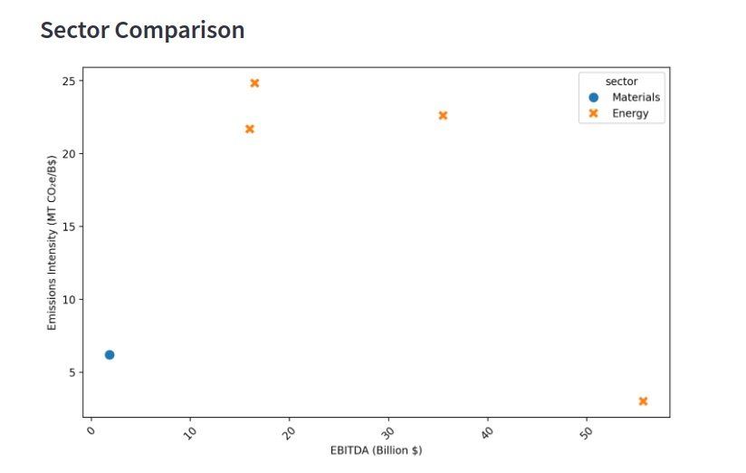

# GHG Emissions Monetization Calculator

## Overview

 What if companies had to foot the bill for the emissions that they caused? 
 
 If that were the case, would airlines still be profitable? And how much would the profitability of oil and gas companies be degraded? 
 
 This is an interesting question that gets to the heart of impact accounting and why many believe that it would be a fundamental improvement upon our current system of valuing business performance.

In order to facilitate an open-ended exploration of the interrelationship between profit and sustainability performance, two data points were chosen for analysis. - - 

- Firstly, greenhouse gas emissions (GHG), as these are widely reported by companies in the form of sustainability and ESG disclosures.
- To enable comparability between industries with often very different environmental footprints. These were standardized on millions of tons of carbon dioxide equivalents.
- Secondly, earnings before interest, tax depreciation and amortization (EBTIDA) was selected as the yardstick for profitability.

The EBITDA figure was calculated at year end in order to provide comparability between the sustainability reporting, which is typically reported retrospectively. Because 2023 reporting frequently reflects 2022 emissions, the financial metric was chosen for the same year.

The visualization tool deployed on Streamlit is backed by data, which is included in this repository at the root level (see: `company_data.csv`). Additionally, the companies included are tagged with their stock ticker (for a future visualisation including live financial feeds). The country in which they are headquartered is included both in its common descriptor and its ISO-3166 identifier.

Although currently not implemented for visualization, these could also be analyzed to attempt to understand the differences in emissions performance between countries and industries.

Gathering and verifying emissions data is a lengthy process. Contributions to the source data and corrections are more than welcome. If you have either, please open a pull request editing the CSV and not other parts of the repository.

## Deployment

The app is hosted on Streamlit Cloud and can be accessed via this link:

 ---

 ## Screenshots, V2

 

 

 

 

 

 

 